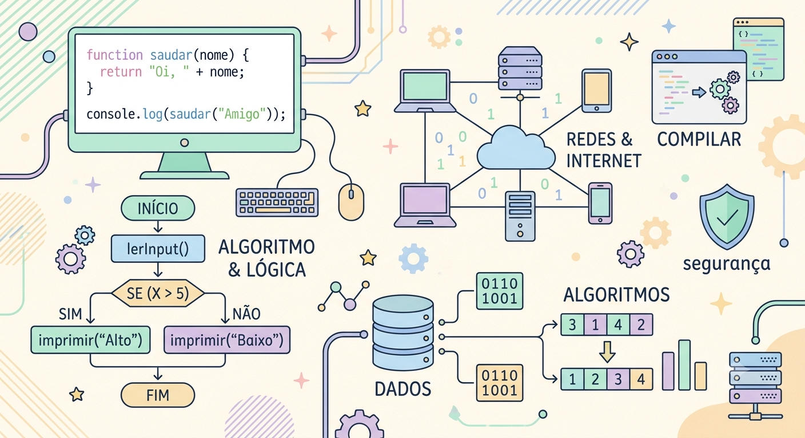

# Meu Perfil
Olá, me chamo **Rafaela Dubeux Godoy**
## Sobre mim:
Graduanda do 1º período de **Ciência da Computação** na **Cesar School** e atualmente estou aprimorando minhas habilidades em **Python, HTML, C++, JavaScrpit e CSS**. Estou com muito entusiasmo e motivação para praticar meus conhecimentos em situações reais.
### Interesses:
- Áreas envolvendo **Inteligência Artificial** e **Ciência de Dados**
- Linguagens **Python** e **C++**
- Utilização de **Arduino**
---
## Redes de Contato:
- Acesse aqui meu [linkedin](linkedin.com/in/rafaela-dubeux-godoy)
- Acesse aqui meu [e-mail](rdg@cesar.school)
- Acesse aqui meu [instagram](https://www.instagram.com/dubeuxrafaela/)

  
  
  

## Minhas Skills:
<code></code>
<code></code>
<code></code>
<code></code>
<code></code>
<code></code>

  
